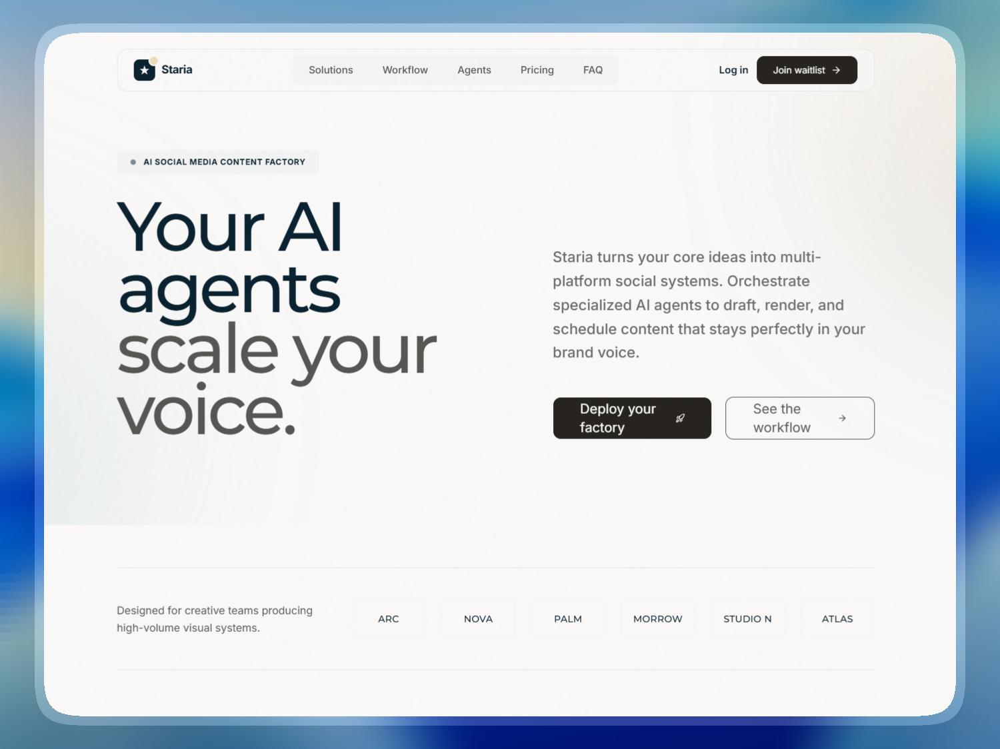

# 🚀 Staria Landing Page
> **Day 7/30 of the "Building 1 AI-Generated Landing Page Every Day" Challenge**



## 🚀 About

Conceptual landing page for **Staria**, an **AI-powered social media content factory**, developed with **Next.js 16**, **TypeScript**, and **Tailwind CSS 4**. This project is the seventh realization of an ambitious challenge: creating **1 complete and functional mockup per day using AI**.

Staria is designed for content creators, agencies, and social media managers who need to scale their presence without losing their voice. The goal is to convey **clarity**, **creativity**, **precision**, and **automation** through a pristine, light-themed, high-end design aesthetic.

Live URL: [https://staria-landing.adrielzimbril.com](https://staria-landing.adrielzimbril.com)

## 🎨 Design & Aesthetic Decisions (The "Why")

For this seventh day, the chosen theme revolves around **AI content generation, social media automation, and creative workflows**.

- **Pristine Luminous Canvas:** The interface relies on a clean white background, sharp Poppins typography, and ample negative space to feel like a high-end creative tool.
- **AI-Infused Accents:** 'Agent Violet' (#a95ef8) is used strictly for AI-driven features and main value propositions, marking the platform's intelligence.
- **High-End Precision:** The design balances corporate seriousness with a futuristic touch, using stark contrast and semi-pill shaped inputs for a signature technical feel.
- **Purposeful Interaction:** Product cards simulate content creation workflows, agent orchestration, and cross-platform scheduling.
- **Minimalist Elevation:** Depth is created through background shifts and color contrast rather than shadows, maintaining a flat and modern digital aesthetic.

## 🧩 Key Sections

- **🌟 Hero Section:** A bold, high-contrast entry point with the core promise: 'Your AI agents can.' using the branded Digital Dawn gradient.
- **🔄 Creative Workflow:** A visual representation of how Staria transforms simple ideas into multi-platform social assets.
- **🧠 AI Agents Bento:** A grid of interactive cards showcasing specialized agents for scriptwriting, image generation, and engagement.
- **📊 Content Dashboard:** Simulates a real-time social media calendar and performance metrics.
- **💳 Pricing System:** Clear, tiered access plans (Starter, Scale, Enterprise) using the 'Cloud White' surface aesthetic.
- **🏢 Modern Footer:** A clean brand close with navigation, social links, and a final call to action.

## 🛠️ Tech Stack

This mockup was built with cutting-edge technologies from the React ecosystem:

- **[Next.js 16](https://nextjs.org/)** (App Router)
- **[React 19](https://react.dev/)**
- **TypeScript** for scalable component architecture and safer iteration.
- **[Tailwind CSS v4](https://tailwindcss.com/)** for design tokens, utilities, and modern CSS support.
- **[Motion/React](https://motion.dev/)** (formerly Framer Motion) for high-performance transitions and layouts.
- **[Lucide React](https://lucide.dev/)** for clean, consistent iconography.
- **Next Font** with **Poppins** for optimized display typography.

## 🚀 Quick Start

```bash
# Install dependencies
pnpm install

# Run development server
pnpm dev
```

Open [http://localhost:3000](http://localhost:3000) in your browser to see the result.

## 🌌 Let's meet in space (or on Earth) 🚀

I'm always happy to discuss new projects, collaborations, or simply exchange creative ideas. Here's how to contact me:

- **📧 Email**: [hello@adrielzimbril.com](mailto:hello@adrielzimbril.com)
- **🌐 Website**: [https://www.adrielzimbril.com](https://www.adrielzimbril.com)
- **🐦 Twitter**: [https://twitter.com/adrielzimbril](https://twitter.com/adrielzimbril)
- **💼 LinkedIn**: [https://www.linkedin.com/in/adrielzimbrilcode](https://www.linkedin.com/in/adrielzimbrilcode)
- **🐼 GitHub**: [https://github.com/adrielzimbril](https://github.com/adrielzimbril)

### 🐼 Fun Facts

- 🚀 Passionate about space exploration and technology
- 🐼 Love pandas (and animals in general!)
- 🎨 Creative at heart, whether in design or code
- ☕ Addicted to coffee and complex technical challenges

## 🌟 Join the Adventure

If you like this project, feel free to:

- ⭐ Star the project
- 🐞 Report bugs
- ✨ Suggest improvements
- 🚀 Share with other enthusiasts

## 💖 Support the Project

If you find this project useful and would like to support its development, you can do so through these platforms:

- [](https://go.adrielzimbril.com/gs)

## 🌐 Hosting

This project is 100% hosted on modern cloud infrastructure for maximum performance and reliability:

- [](https://vercel.com)

## 📄 License

This project is under the MIT license. Feel free to use it as a base for your own portfolio or project.

---

**Developed with ❤️ by Adriel Zimbril**  
_Product Designer & Fullstack Developer_  
🚀 Digital Universe Explorer | 🐼 Panda Friend | 🎨 Passionate Creator
